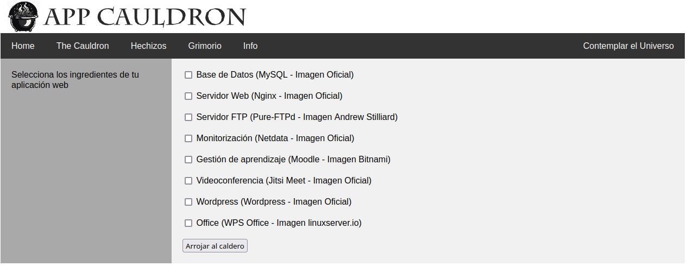

# AppCauldron - **Elabora tu aplicación web.**  

Proyecto final del Ciclo de Grado Superior en Administración de Sistemas Informáticos en Red (ASIR).

---

## ¿Qué es AppCauldron?

AppCauldron es una solución web construida con Apache, PHP y bash scripting que permite seleccionar servicios como Moodle, Wordpress, MySQL, entre otros, desde un formulario web denominado "The Cauldron" (Ilustración A).

Generaremos un archivo spell.yaml para poder iniciar con docker-compose contenedores con las imágenes de los servicios seleccionados y sus instrucciones, utilizando únicamente la interfaz web de forma rápida y cómoda.

Por la similitud a arrojar ingredientes (servicios) en un caldero para crear un hechizo, la hemos denominado AppCauldron.

<p align="center">
  
  <br>
  <em>Ilustración A - Vista de la página 'The Cauldron'.</em>
</p>

Adicionalmente, desde la propia interfaz web podremos:

- Parar los servicios, reanudarlos, eliminar los contenedores o eliminar el archivo.

- Consultar las instrucciones de uso de los servicios seleccionados.

- Consultar la salida de los principales comandos que se utilizan en Docker y que se lanzan a través de scripts.

Se ha trabajado en una forma modular que permita escalar fácilmente la cantidad de servicios, su puesta en marcha y su documentación a través de la carpeta templates del proyecto.

Mejoras que se querrían añadir en un futuro:

- Apartado visual.

- Generar una imagen de Docker con Dockerfile y subirlo a Docker Hub o a GitHub.

- Trabajar en una documentación o sistema para que cualquiera añada aplicaciones al formulario de una manera fácil.

- Poder generar varios hechizos o ficheros de configuración.

- “Hechizos avanzados”, poder elegir varios aspectos en el formulario de creación, como el nombre de proyecto, nombres de usuarios a crear o contraseñas, selección de puertos, etc.

- Crear un apartado de enlaces a tutoriales y documentación.

---

## 🧩 Funcionamiento

En el menú "The Cauldron" (Ilustración A) seleccionamos los servicios que queremos iniciar.

Al usuario apache www-data se le ha dado permiso para lanzar scripts de una carpeta concreta como usuario del sistema.

A continuación, se lanza un script (magic_cauldron.sh) que recibe las variables correspondientes a la selección a través del formulario.

Conforme a ellas añade código a través de una plantilla preparada para cada servicio con la configuración adecuada.

Esto da forma a un archivo, spell.yaml, que hemos denominado hechizo, y que nos permitirá con el comando docker-compose iniciar los contenedores que contengan las imágenes de los servicios deseados.

Adicionalmente generamos un archivo grimoire.txt con las instrucciones de uso.

Por la magnitud y complejidad a la que se puede llegar, se ha decidido configurar un total de 8 servicios basados en imágenes Docker disponibles online.

Algunos requieren servicios adicionales para su correcto funcionamiento, llegando a desplegar hasta 14 contenedores actualmente.

Se ha realizado un trabajo de configuración y revisión de puertos para que puedan convivir todas a la vez en una misma red de Docker.

Para llevar más allá a AppCauldron, desde el menú “Hechizos” (Ilustración B) se han habilitado botones para lanzar el comando docker-compose con nuestro archivo generado, iniciando así los servicios en contenedores.

<p align="center">
  
  <br>
  <em>Ilustración B - Vista de la página 'Hechizos'.</em>
</p>

Adicionalmente, podemos parar los servicios, reanudarlos, eliminar los contenedores o eliminar el hechizo.

Desde el menú Grimorio (Ilustración C), podemos consultar la información (el archivo grimoire.txt generado previamente) para revisar que el servicio o servicios seleccionados están funcionando.

<p align="center">
  
  <br>
  <em>Ilustración C - Vista de la página 'Grimorio'.</em>
</p>

Se puede acceder a la información de puertos, usuarios, contraseñas y comandos de terminal para acceder directamente a los servicios, o enlaces a las imágenes y la documentación oficiales.

Finalmente, desde el menú Contemplar el Universo (Ilustración D), se puede consultar la salida de los principales comandos que se utilizan en Docker y que se lanzan a través de scripts por el usuario www-data.

<p align="center">
  
  <br>
  <em>Ilustración D - Vista de la página 'Contemplar el Universo'.</em>
</p>

Es posible eliminar parte o toda la información de los contenedores, volúmenes, redes e imágenes a través de botones, convirtiendo a AppCauldron en una herramienta ágil para trabajar, y comprender de manera muy visual el funcionamiento de Docker y docker-compose.

Se ha trabajado en una forma modular que permita escalar fácilmente la cantidad de servicios, su puesta en marcha y su documentación a través de la carpeta templates del proyecto, como se puede observar en la Ilustración E.


- Generación automática de configuración `docker-compose.yaml` según servicios seleccionados.
- Documentación dinámica de los servicios (usuarios, contraseñas, enlaces).
- Scripts Bash para lanzar, detener, eliminar y consultar contenedores.
- Interfaz web estructurada:  
  - **El Caldero:** selecciona servicios  
  - **Hechizos:** gestiona contenedores  
  - **Grimorio:** consulta información  
  - **Contemplar el universo:** monitoriza estado de Docker

---

## 🗃️ Estructura del Proyecto
```
appcauldron/
├── /var/www/html/appcauldron.com/
                      ├── index.html
                      ├── cauldron.html
                      ├── cauldron2.php
                      ├── spells.php
                      ├── grimoire.php
                      ├── commands.php
                      ├── info.html
                      └── templates/
                          ├── database
                          ├── database.volumes
                          ├── database.info
                          ├── nginx
                          ├── nginx.info
                          ├── ftp
                          ├── ftp.info
                          ├── netdata
                          ├── netdata.volumes
                          ├── netdata.info
                          ├── lms
                          ├── lms.volumes
                          ├── lms.info
                          ├── jitsi
                          ├── jitsi.info
                          ├── wordpress
                          ├── wordpress.volumes
                          ├── wordpress.info
                          ├── office
                          └── office.info
                      └── generatedfiles/
                          └── .env
                      └── scripts/
                          # Ejecución en /var/www/html/appcauldron/cauldron2.php
                          ├── magic_cauldron.sh
                          # Botones /var/www/html/appcauldron.com/spells.php
                          ├── cast_spell.sh
                          ├── stop_spell.sh
                          ├── resume_spell.sh
                          ├── undo_spell.sh
                          # Ejecución en /var/www/html/appcauldron/commands.php
                          ├── docker_ps.sh
                          ├── docker_container_ls.sh
                          ├── docker-compose_ls.sh
                          ├── docker_network_ls.sh
                          ├── docker_volume_ls.sh
                          ├── docker_images.sh
                          # Botones /var/www/html/appcauldron.com/commands.php
                          ├── delete_stopped_containers.sh
                          ├── delete_containers.sh
                          ├── delete_active_containers.sh
                          ├── delete_anon_networks.sh
                          ├── delete_anon_vols.sh
                          └── delete_volumes.sh
                      └── images/
                          ├── delete_anon_vols.sh
                      └── css/
                          └── appcauldron-style.css


├── scripts/ # Scripts de automatización (bash)
├── templates/ # Plantillas YAML para servicios
├── public/ # Interfaz web (PHP + HTML)
├── spell.yaml # Ejemplo de salida generada
├── grimoire.txt # Documentación dinámica generada
├── README.md
└── LICENSE.md

```
---

## ⚙️ Requisitos

- Instalar [Ubuntu 22.04.1 Desktop](https://old-releases.ubuntu.com/releases/22.04.1/ubuntu-22.04.1-desktop-amd64.iso)

Nombre de equipo y usuario: appcauldron


- Instalar Apache2

Instalamos y comprobamos apache2
```
sudo apt update
sudo apt install apache2
sudo systemctl status apache2
```
Si al ejecutar el status aparece el error AH00558, editamos el archivo apache2.conf:
```
sudo nano /etc/apache2/apache2.conf
```
Añadimos al final
```
ServerName 127.0.0.1
```
Comprobamos y reiniciamos el servicio apache2
```
sudo apachectl configtest
sudo systemctl reload apache2.service
```
Activamos el firewall ufw y lo configuramos para abrir los puertos 80 y 443, habilitando el perfil 'Apache Full', que incluye reglas para ambos puertos:
```
sudo ufw allow 'Apache Full'
sudo ufw enable
sudo ufw status
```


- Servidor Virtual

Creamos el directorio que contendrá la web, un index.html de prueba y damos permisos a www-data:
```
sudo mkdir -p /var/www/html/appcauldron.com
sudo touch /var/www/html/appcauldron.com/index.html
sudo chown -R www.data: /var/www/html
sudo nano /var/www/html/appcauldron.com/index.html
```
Contenido index.html:
```
<!DOCTYPE html>
<html lang="es-ES" dir="ltr">
  <head>
    <meta charset="utf-8">
    <title>Bienvenido a mipagina.com</title>
  </head>
  <body>
    <h1>¡Éxito! ¡Página de inicio de mipagina.com!</h1>
  </body>
</html>
```
Creamos la configuración de nuestro servidor virtual.
```
sudo nano /etc/apache2/sitios-disponibles/appcauldron.com.conf
```

Contenido appcauldron.com.conf:
```
<VirtualHost *:80>
    ServerAdmin appcauldron@appcauldron.com
    DocumentRoot /var/www/html/appcauldron.com/
    ServerName appcauldron
    ServerAlias www.appcauldron

    <Directory /var/www/html/appcauldron.com/>
        Options Indexes FollowSymLinks MultiViews
        AllowOverride All
        Order allow,deny
        allow from all
    </Directory>
    ErrorLog ${APACHE_LOG_DIR}/appcauldron.com-error.log
    CustomLog ${APACHE_LOG_DIR}/appcauldron.com-access.log combined
</VirtualHost>
```

Activamos la configuración, comprobamos que es correcta (configtest debe responder Syntax OK) y reiniciamos el servicio apache.
```
sudo a2ensite appcauldron.com
sudo apachectl configtest
sudo systemctl restart apache2
```

Comprobamos que accedemos correctamente a http://appcauldron/

Damos permiso al usuario apache www-data para ejecutar scripts de la carpeta /var/www/html/appcauldron.com/scripts como usuario appcauldron modificando /etc/sudoers:
```
sudo nano /etc/sudoers
```
Añadimos:
```
www-data ALL=(appcauldron) NOPASSWD: /var/www/html/appcauldron.com/scripts/
```

- Docker + docker-compose
Instalamos los paquetes necesarios para instalar el repositorio de docker:
```
sudo apt install -y ca-certificates curl gnupg lsb-release
```

Añadimos la clave gpg de Docker en el sistema. Posteriormente instalamos el repositorio docker:
```
sudo mkdir -p /etc/apt/keyrings
curl -fsSL https://download.docker.com/linux/ubuntu/gpg | sudo gpg --dearmor -o /etc/apt/keyrings/docker.gpg
sudo echo "deb [arch=$(dpkg --print-architecture) signed-by=/etc/apt/keyrings/docker.gpg] https://download.docker.com/linux/ubuntu $(lsb_release -cs) stable" | sudo tee /etc/apt/sources.list.d/docker.list > /dev/null
sudo apt update
```

Instalamos Docker:
```
sudo apt install -y docker-ce docker-ce-cli containerd.io docker-compose-plugin
```

Comprobamos que funciona la instalación (deberíamos ver el mensaje Hello from Docker !):
```
sudo docker run hello-world
```

Creamos un grupo docker para evitar tener que usar sudo con el usuario appcauldron:
```
sudo groupadd docker
sudo usermod -aG docker $USER
```

Instalamos docker-compose y comprobamos que se ha instalado correctamente:
```
sudo curl -L "https://github.com/docker/compose/releases/latest/download/docker-compose-$(uname -s)-$(uname -m)" -o /usr/local/bin/docker-compose
sudo chmod +x /usr/local/bin/docker-compose
docker-compose --version
```

- MariaDB y PHP:

Instalamos mariadb-server con el comando:
```
sudo apt install mariadb-server
```

Ejecutamos el script de seguridad (contestamos enter para contraseña y n:
```
sudo mysql_secure_installation
```

Instalamos php y el módulo apache con el comando. Posteriormente los paquetes opcionales:
```
sudo apt install php libapache2-mod-php
sudo apt install php-cgi
sudo apt install php-mysql
sudo apt install php-pgsql
```

Reiniciamos apache y creamos una página de prueba. Volvemos a dar propietario/grupo a www-data sobre el directorio /var/www/html:
```
sudo systemctl restart apache2.service
sudo nano /var/www/html/appcauldron.com/testphp.php
sudo chown www-data:www-data -R /var/www/html
```

Contenido testphp.php:
```
<?php
  phpinfo();
```


---

## 📦 Servicios utilizados y disponibles en AppCauldron

A través de los enlaces podéis acceder a las imágenes utilizadas y su documentación:

- 🧱 [MySQL – Imagen Oficial](https://hub.docker.com/_/mysql) – Base de Datos
- 🖥️ [Nginx - Imagen Oficial](https://hub.docker.com/_/nginx) – Servidor Web
- 🧰 [Pure-FTPd - Imagen Andrew Stilliard](https://github.com/stilliard/docker-pure-ftpd) – Servidor FTP
- 🔎 [Netdata - Imagen Oficial](https://hub.docker.com/r/netdata/netdata) – Monitorización
- 🎓 [Moodle - Imagen Bitnami](https://github.com/bitnami/containers/tree/main/bitnami/moodle) – Gestión de aprendizaje
- 📡 [Jitsi Meet - Imagen Oficial](https://github.com/jitsi/docker-jitsi-meet) – Videoconferencia
- 🌐 [Wordpress - Imagen Oficial](https://hub.docker.com/_/wordpress) – Wordpress
- 📝 [WPS Office - Imagen linuxserver.io](https://hub.docker.com/r/linuxserver/wps-office) – Office

---

## 🧪 Casos de uso

- Prácticas de estudiantes en administración de sistemas y DevOps.
- Laboratorios educativos sobre contenedores Docker.
- Presentación de proyectos personales o prototipos.

---

## 📜 Licencia

Este proyecto se publica bajo una licencia personalizada de **uso educativo y no comercial**.  
Consulta el archivo [LICENSE.md](LICENSE.md) para más detalles.

---

## 👤 Autor

**Francisco Javier Loscos Gil**  
Proyecto final – IES Pablo Serrano, 2024  
📧 meterre@gmail.com

---

## 🌐 Enlaces

- [Presentación del proyecto (PPTX)](https://github.com/Metr81/appcauldron/assets/presentacion)
- [Documentación técnica (PDF)](https://github.com/Metr81/appcauldron/assets/memoria)
